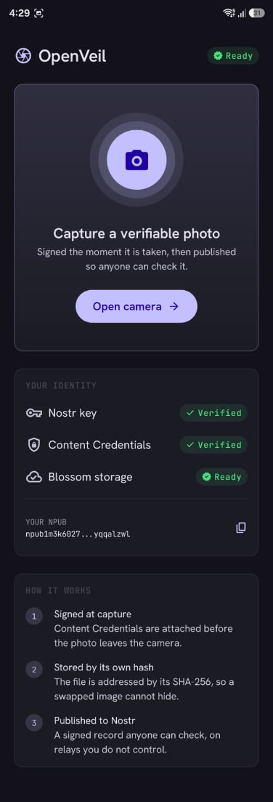
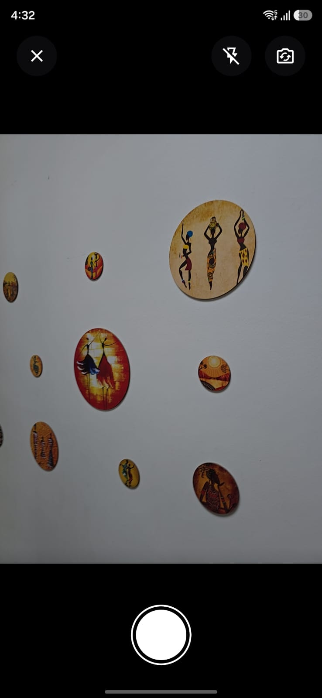
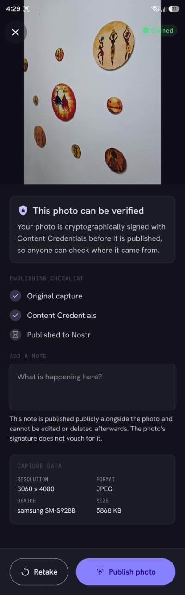
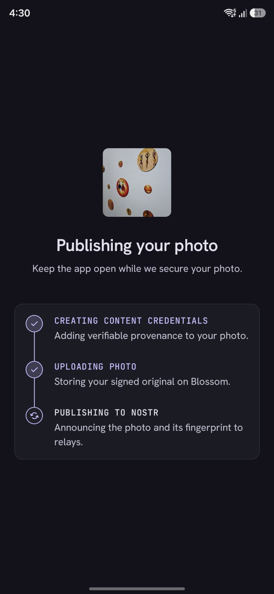
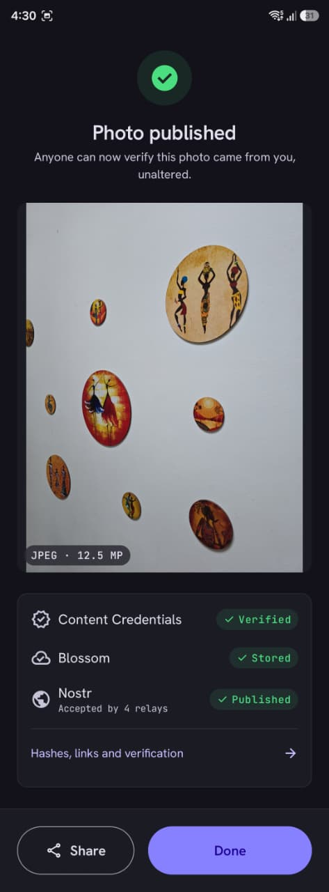
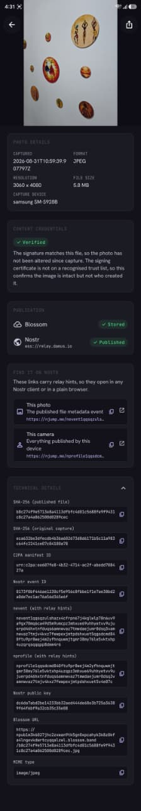

# OpenVeilCam

[openveil.world](https://openveil.world)

**Cameras that prove their photographs were not altered — and publish that proof where no
one can quietly withdraw it.**

Every capture leaves the device carrying a [C2PA][c2pa] manifest bound to its exact bytes,
is stored content-addressed on [Blossom][blossom], and is announced in a signed NIP-94
event on [Nostr][nostr] relays. Anyone can then check, without trusting OpenVeil or its
author, that the image they are looking at is byte-for-byte the image that came off the
sensor.

This repository holds two implementations of that idea, sharing one protocol design:

| Component | Platform | |
|---|---|---|
| **`openveil-cam`** | Raspberry Pi | Rust. Fixed-install camera. Repository root. |
| **`app/`** | Android today; iOS, desktop and web planned | Kotlin Multiplatform. See [app/README.md](app/README.md). |

Both publish to the same relays and the same Blossom servers under the same event kinds,
so a capture from either is discoverable and verifiable the same way.

> **Status: working proof of concept.** The full capture → sign → store → publish → verify
> pipeline runs end to end against live public infrastructure. It is not yet production
> software; the limitations are listed plainly in
> [Current limitations](#current-limitations).

<p align="center">
  
  
  
  
  
  
</p>

---

## The problem

Photographic evidence is losing its evidentiary value. Generative models can produce
convincing images of events that never happened, and — more corrosively — their existence
gives anyone caught on camera a ready denial. A journalist or human rights investigator who
publishes a genuine photograph now has to argue for its authenticity, and has no better
tool for that argument than their own credibility.

The usual answer is a trusted platform that vouches for uploads. That fails exactly where
it matters most: a platform can be pressured, can be blocked in the jurisdiction that needs
it, can lose interest, and can quietly delete. Anyone whose safety depends on a photograph
remaining verifiable cannot afford a verifier with a business model.

## The approach

OpenVeil replaces institutional trust with a chain anyone can check independently:

```
   ┌──────────┐   The exact bytes the encoder produced. Never re-encoded.
   │  Sensor  │
   └────┬─────┘
        │
        ▼
   ┌──────────────────┐   The C2PA manifest is hard-bound to those bytes. Any later
   │  Sign (C2PA)     │   edit breaks the binding, and validators report it.
   └────┬─────────────┘
        │
        ▼
   ┌──────────────────┐   SHA-256 of the *signed* bytes. This is the fingerprint
   │  Hash            │   everything downstream refers to.
   └────┬─────────────┘
        │
        ▼
   ┌──────────────────┐   Blossom is content-addressed: the URL *is* the hash, so a
   │  Store (Blossom) │   substituted file cannot go unnoticed.
   └────┬─────────────┘
        │
        ▼
   ┌──────────────────┐   A NIP-94 event carries url + hash + dimensions, signed with
   │  Publish (Nostr) │   the device key, replicated across relays no one party owns.
   └──────────────────┘
```

Each link is verifiable on its own, and the chain closes in both directions: the C2PA
manifest names the Nostr public key that published it, and the Nostr event names the hash
of the file that manifest is bound to. Neither half can be swapped for another without the
mismatch showing.

**What this proves:** that a specific image is byte-identical to what a specific key signed
at capture time, and that it has not been altered since.

**What it does not prove:** that the photographer was where they claim, that any caption is
true, or — in this proof of concept — who the photographer is. Those are different
problems, and conflating them is how provenance tools mislead people. See
[app/docs/VERIFICATION.md][verification] for precisely what a green tick means and what it
does not.

## Verify it yourself

Every claim above is checkable without running either camera, and without trusting this
project. Given a published capture you can fetch the event from a relay, download the blob,
re-hash it, and confirm it matches what was signed.

**[app/docs/VERIFICATION.md][verification]** walks through the complete procedure, including
validating the C2PA manifest and reading the certificate's trust status honestly.

## Standards implemented

Implemented directly against the specifications rather than through a framework. Each is
unit-tested against published vectors or an independent reference implementation.

| Standard | Use |
|---|---|
| [C2PA 2.x][c2pa] | Content Credentials — minted on capture, read by the bridge |
| [NIP-01][nip01] | Event serialisation, ids, BIP-340 Schnorr signatures |
| [NIP-19][nip19] | `npub`, plus `nevent`/`nprofile` with TLV relay hints |
| [NIP-92][nip92] | `imeta` tag, so ordinary clients render the image inline |
| [NIP-94][nip94] | Kind 1063 file metadata: `url`, `m`, `x`, `ox`, `size`, `dim`, `alt` |
| [BUD-01/02][blossom] | Blossom blob upload and retrieval |
| [BUD-11][bud11] | Kind 24242 authorization events |
| [BIP-340][bip340] | Schnorr signatures |
| [BIP-173][bip173] | Bech32 encoding |

---

# The handheld app (`app/`)

The Kotlin Multiplatform client. Same pipeline, same protocol: signs at the shutter,
uploads to Blossom, publishes NIP-94, and can re-verify a capture against its stored bytes
on device. Android runs today; the domain layer is already platform-neutral, so iOS,
desktop and web are additive.

Full documentation is in **[app/README.md](app/README.md)** and [app/docs/](app/docs/).

## What works today

| Capability | Status | Notes |
|---|---|---|
| Camera capture | Working | CameraX; bytes never re-encoded, EXIF orientation preserved |
| C2PA signing | Working | `c2pa.created` + `digitalCapture`, in-memory, ES256 |
| SHA-256 hashing | Working | Over the signed bytes; published as the NIP-94 `x` tag |
| Blossom upload | Working | BUD-01/02 with BUD-11 auth, multi-server fallback |
| Nostr publishing | Working | NIP-94 kind 1063 + NIP-92 `imeta` + companion kind 1 |
| Shareable links | Working | NIP-19 `nevent` / `nprofile` carrying relay hints |
| Re-verification | Working | Re-checks the manifest against the stored bytes, in-app |
| Captions | Working | Published with the photo, deliberately outside the credential |
| Device identity | Working | secp256k1 key generated on device, wrapped by Android Keystore |
| Android | Working | minSdk 28, 16 KB page aligned |
| iOS / Desktop / Web | Not yet | Source sets exist; implementations do not |
| Offline queue | Not yet | Captures survive on disk, but there is no cross-launch retry |
| Trusted certificate | Not yet | Development identity only — see limitations |

## Building the app

**Requirements:** JDK 21 and the Android SDK (API 36). Android Studio is optional — the
Gradle wrapper is sufficient.

```bash
git clone https://github.com/PrarthanaPurohit/OpenVeilCam.git
cd OpenVeilCam/app
```

Generate the development C2PA signing identity. This is deliberately **not** in version
control — a signing key must never be committed, and a certificate without its matching key
would be worse than none, because it looks usable and is not:

```bash
bash tools/generate-dev-cert.sh
```

Then build and test:

```bash
./gradlew :shared:testAndroidHostTest
```

```bash
./gradlew :androidApp:assembleDebug
```

The APK lands in `app/androidApp/build/outputs/apk/debug/`. Prebuilt APKs are attached to
every [release](../../releases) tagged `app-v*`, cut automatically when a change under
`app/` reaches the default branch. There is one APK per architecture; most phones need
`arm64-v8a`.

## App architecture

Three Gradle modules — a split forced by AGP 9, which forbids combining
`com.android.application` with the Kotlin Multiplatform plugin, and useful independently:

```
shared/       Domain and data. No Compose, and no platform SDK types in its public API.
              crypto · nostr · blossom · c2pa · publish · storage
composeApp/   Compose Multiplatform UI. Depends on `shared`; cannot see Ktor or JNI types.
androidApp/   Thin Android host: MainActivity and manifest, no business logic.
```

The UI module's inability to reference networking or native types is enforced by the
dependency graph rather than by convention — `shared` exposes a single assembled
`OpenVeilCore`, which makes "no HTTP types in the UI layer" a fact the compiler checks
rather than a rule people remember.

See **[app/docs/ARCHITECTURE.md][architecture]** for module boundaries, the publish state
machine, and the ordering guarantees the pipeline depends on.

## App testing

```bash
./gradlew :shared:testAndroidHostTest
```

45 unit tests, concentrated on the places where a silent error would be both invisible and
fatal:

- **NIP-01 event ids**, recomputed from a known published event and cross-checked against
  an independent Python implementation. A single wrong byte in the canonical serialisation
  yields an id every relay rejects, with no useful diagnostic.
- **BIP-340 Schnorr** sign and verify round-trips.
- **Bech32 and NIP-19**, against a real published `npub`, with `nprofile`/`nevent` TLV
  encodings checked against an independent JavaScript reference written from the spec.
- **NIP-94 tags**, including the invariant that `x` comes from the server's response rather
  than a local variable that may have drifted.
- **BUD-11 auth events**: kind, `created_at` in the past, `expiration` in the future, and
  base64url *without* padding — three mistakes that all surface as an opaque HTTP 401.

An opt-in live integration suite exercises real Blossom servers and relays; see
[app/docs/ARCHITECTURE.md][architecture].

Every push additionally verifies that all native libraries are 16 KB page aligned — a
requirement Google Play enforces for Android 15+ targets, and one a dependency bump can
silently break.

---

# The fixed-install camera (`openveil-cam`)


## Content Credentials on capture

Every frame the Pi captures leaves with a real C2PA manifest embedded in it,
signed by the device. Any C2PA tool — `c2patool`, Adobe's Verify, the browser
extensions — reads it without knowing that Nostr exists.

The manifest asserts `c2pa.created` with a `digitalCapture` source type: these
pixels came off a sensor, not out of a generator or an editor. Alongside it
sits a `world.openveil.nostr` assertion carrying the device's npub, its hex
pubkey, and the `px1` hash.

### The two keys

The Nostr identity is secp256k1. C2PA does not permit that curve — the spec
allows only the NIST P-curves, RSA-PSS and Ed25519 — so the credential is
signed by a **separate P-256 key derived from the same hardware entropy**. Both
keys are re-derived on every run and neither is written to disk; only the
self-signed certificate is persisted, at `~/.hardware_identity/c2pa_cert.pem`.

The npub is the certificate's subject *and* is repeated inside the manifest,
while the NIP-94 event published afterwards points back at the asset. The
binding holds from either direction, so losing one does not break the other.

### Why it reads `Valid` and not `Trusted`

The certificate is self-signed, so validators report `Valid` — the signature is
cryptographically sound — but not `Trusted`, which would require chaining to
the C2PA trust list via their Conformance Program. That is the intended
posture, and the same argument the bridge makes below: cryptographic validity
comes from C2PA, trust comes from the Nostr identity.

Embedding a manifest adds a JUMBF box without touching pixels, so the `px1`
hash is identical before and after signing — the Nostr side can key off it
either way. Pinned by `c2pa_sign::tests::signing_preserves_the_px1_hash`.

## C2PA bridge (`c2pa-bridge`)

Where the section above *mints* credentials for this device's own captures,
the bridge *distributes* credentials minted by someone else's hardware.

Content Credentials ([C2PA](https://c2pa.org)) already ship in hardware from
Leica, Nikon, Canon, Fujifilm and Panasonic. OpenVeil does not re-implement
that. What C2PA lacks is somewhere decentralized to *put* a manifest: the
credential is embedded in the asset, so a platform re-encode destroys it, and
C2PA's own remedy — a remote manifest URL — points at a single HTTP endpoint.

`c2pa-bridge` is the distribution layer. It ingests an asset signed by any
C2PA-capable device (no keys of our own involved), stores the asset and a
detached copy of its manifest on Blossom, and publishes a Nostr event binding
them together. It needs no camera and no Raspberry Pi.

```bash
# Read and validate a manifest
cargo run --bin c2pa-bridge -- inspect photo.jpg

# Build the credential event (dry run: nothing is uploaded or broadcast)
cargo run --bin c2pa-bridge -- publish photo.jpg --out event.json

# Actually upload to Blossom and broadcast to relays
cargo run --bin c2pa-bridge -- publish photo.jpg --live

# Re-derive every binding from the asset, trusting nothing in the event
cargo run --bin c2pa-bridge -- verify photo.jpg event.json
```

### The event

A plain NIP-94 (`kind:1063`) file-metadata event with namespaced `c2pa-*`
tags. **No new event kinds and no new NIP** — unknown tags are ignored by
clients that do not understand them, so this ships without ratifying anything.

| Tag | Meaning |
|---|---|
| `url`, `m`, `x`, `size`, `dim` | Standard NIP-94 fields |
| `px1` | Pixel-canonical hash (see scope below) |
| `c2pa-state` | `Valid` / `Trusted` / `Invalid` as observed at ingest |
| `c2pa-manifest` | Blossom URL of the detached manifest |
| `c2pa-manifest-hash` | SHA-256 of the canonical manifest JSON |
| `c2pa-generator`, `c2pa-issuer`, `c2pa-signed-at` | Signer metadata |

`c2pa-state` is a convenience, not an authority: `verify` re-validates the
manifest locally and ignores what the event claims.

### Trust model

C2PA's "Trusted" state requires the signing certificate to chain to the
official C2PA Trust List via its Conformance Program — a centralized PKI.
OpenVeil treats `Valid` (cryptographically sound) as sufficient and resolves
*trust* against Nostr identities instead, so provenance does not depend on a
corporate CA. `verify` reports trust-list status separately rather than
conflating it with validity.

### What `px1` does and does not do

`px1` hashes the decoded raster rather than the file bytes, so it survives
EXIF/ICC stripping and lossless container rewrapping — which is what makes a
detached manifest findable after metadata is stripped. It does **not** survive
lossy re-encoding, resizing or cropping; surviving platform re-compression
needs a perceptual hash or watermark, which px1 is not. Both properties are
pinned by `canon::tests::px1_binds_pixels_not_containers`.

## Prerequisites

**Target device (Raspberry Pi):**
- Compatible camera module (e.g. IMX708 on RPi 5)
- Rust toolchain (`rustc`, `cargo`)

Network connectivity is required for publishing images to Nostr.

## Deployment

Edit the `RPI` variable in `deploy.sh` to match your device's SSH address, then:

```bash
./deploy.sh
```

This copies source files and runs `cargo build` on the Pi.

## Usage

On the Raspberry Pi:

```bash
cargo run
```

### Process flow

Capture uses the Pi’s standard still capture CLI (`rpicam-still` on `PATH`, e.g. from Raspberry Pi OS `rpicam-apps` / `libcamera-apps`).

1. **Detect cameras** — Lists cameras and parses the tool’s output.
2. **Capture** — Writes a JPEG to `/tmp/nostreye_capture.jpg` (1920×1080, quality 95).
3. **Device identity** — Initialises hardware-linked identity (secp256k1) using `device-signer`.
4. **Profile (kind 0)** — Signs and broadcasts a metadata event so your npub shows a profile (name, display_name, about) across Nostr clients. Sent first so relays have the profile before any other events.
5. **Content Credentials** — Embeds a device-signed C2PA manifest and writes the result to `/tmp/nostreye_capture_c2pa.jpg`. From here on it is the *signed* file that gets hashed, uploaded and published. If signing fails the run continues on the unsigned frame and says so loudly, since a camera that publishes nothing is worse than one that publishes an uncredentialed frame.
6. **Frame integrity** — Computes ECDSA signature over the JPEG bytes (attestation).
7. **Publish** — Uploads the image to Blossom (BUD-01 auth), then broadcasts:
   - **Kind 1** — Text note with the image URL (visible in Damus, Primal, Snort, etc.).
   - **Kind 1063** — NIP-94 file-metadata event with URL, SHA256, dimensions, and ECDSA attestation.
   Relays: `relay.damus.io`, `nos.lol`, `relay.primal.net`, `relay.snort.social`, `nostr.mom`.

### Viewing the captured image

Copy from the Pi to your machine:

```bash
scp user@<rpi-ip>:/tmp/nostreye_capture_c2pa.jpg .
```

That is the credentialed file — drop it into [Content Credentials Verify](https://contentcredentials.org/verify) or run `cargo run --bin c2pa-bridge -- inspect` on it. The unsigned original stays at `/tmp/nostreye_capture.jpg`.

### Viewing in Nostr clients

Add your npub (printed at startup) to Damus, Primal, Snort, or any Nostr client. The profile (kind 0) and image posts (kind 1 with URL) will appear in your feed and on your profile page.

### Keys and nsec

The device uses `device-signer` to derive a deterministic secp256k1 key from hardware entropy (CPU serial, MAC, machine ID) and a persisted salt. The secret is derived on demand for signing and **is not exported as nsec** — this is by design to avoid leaking the key.

**What you can see:**
- **npub** — Printed at startup (`Device Identity`). Use this to follow your device from any Nostr client.
- **pubkey (hex)** — Same key in hex; useful for relay filters and event lookups.

**If you need nsec** (e.g. to import into Damus, Primal, or another client):
- `device-signer` does not expose the raw secret. The key lives only in memory during signing.
- Options: extend [device-signer](https://github.com/prarthanapurohit/device-signer) to add an `nsec()` or `export_secret()` method (requires changing the crate’s API and accepting the security tradeoff), or use a separate software-backed key for Nostr and keep the hardware identity only for attestation.

## Core libraries

- **device-signer** — Hardware-linked identity; Schnorr and ECDSA signing.
- **c2pa** — Content Credentials: minting manifests on capture, reading them in the bridge.
- **p256 / openssl** — The ES256 credential key and its self-signed certificate.
- **nostr** — Event building and verification.
- **reqwest** — HTTP client (Blossom upload).
- **tokio-tungstenite** — WebSocket client (relay publish).
- **tokio** — Async runtime.

---

## Project structure

The Rust crate lives at the repository root; the multiplatform application is a
self-contained Gradle build under `app/`. They share no build system and are developed
independently, so `cargo build` at the root behaves exactly as it always has.

```
.
├── src/, Cargo.toml, deploy.sh   Raspberry Pi firmware (Rust)
├── app/                          Kotlin Multiplatform application
│   ├── shared/                     domain and protocol logic, platform-neutral
│   ├── composeApp/                 Compose Multiplatform UI
│   └── androidApp/                 Android host  (iOS, desktop and web to follow)
└── .github/workflows/            Path-filtered CI: app changes do not trigger
                                  firmware builds, and vice versa
```

- `OpenVeilCam`: A Rust application that discovers the Pi camera, captures stills to JPEG,
  embeds a device-signed C2PA manifest, generates cryptographic signatures via
  hardware-linked identity (`OpenVeilSigner`), and publishes to Nostr via Blossom and relays.
- `c2pa-bridge`: Publishes Content Credentials minted by *other* devices. Needs no camera.
- `deploy.sh`: Deploys and builds `OpenVeilCam` from your development environment to a
  Raspberry Pi over SSH.
- `app/`: The handheld client. Documentation, including how a third party verifies a capture
  without trusting this project, is in [app/docs/](app/docs/).

## Current limitations

Stated plainly, because a provenance tool that oversells itself is worse than none.

1. **The signing certificate is a generated development identity.** Validators report
   captures as *Valid* but not *Trusted*: the tamper-evidence is real and independently
   checkable, but nothing vouches for who signed. Production needs a CA-issued certificate
   and a hardware-held key. The app says exactly this rather than showing an unqualified
   tick.
2. **Released APKs are debug-signed** — for sideloading and review, not for Google Play.
3. **No location, ever, in this build.** Publishing to Nostr is irreversible and public, and
   a precise coordinate attached to a photograph is the most harmful thing this pipeline
   could leak. The app does not request the permission, does not read GPS, and writes no
   location assertion.
4. **Identity is per-device and non-portable.** The key is generated on the phone and never
   leaves it. There is no backup, export or import — which also means a lost device is a
   lost identity.
5. **The app is Android only.** The multiplatform structure is real and the domain layer is
   platform-neutral, but only Android has an implementation behind it.
6. **No persistent offline queue.** A signed capture survives on disk if publishing fails
   and can be retried in-session, but not yet across app launches.

## Roadmap

Near-term, in dependency order:

1. **Persistent capture queue** — survive process death and retry publication on reconnect.
   This is the prerequisite for genuinely field-usable offline capture.
2. **Trusted signing identity** — CA enrolment, plus hardware-backed keys via
   `Signer.withCallback` so the private key never enters the process.
3. **iOS** — AVFoundation capture and the `c2pa-swift` bridge. The domain layer is already
   platform-neutral; only the bindings are missing.
4. **Desktop and Web** — verification-focused builds, so a recipient can check a capture
   without installing anything.
5. **Identity portability** — encrypted backup and import, so losing a device is not losing
   an identity.

## Contributing

Issues and pull requests are welcome. CI runs the full test suite, builds the APK, and
checks native library alignment on every pull request.

## License

[MIT](LICENSE), covering the whole repository.

[c2pa]: https://c2pa.org/specifications/specifications/2.1/index.html
[nostr]: https://github.com/nostr-protocol/nostr
[blossom]: https://github.com/hzrd149/blossom
[bud11]: https://github.com/hzrd149/blossom/blob/master/buds/11.md
[nip01]: https://github.com/nostr-protocol/nips/blob/master/01.md
[nip19]: https://github.com/nostr-protocol/nips/blob/master/19.md
[nip92]: https://github.com/nostr-protocol/nips/blob/master/92.md
[nip94]: https://github.com/nostr-protocol/nips/blob/master/94.md
[bip340]: https://github.com/bitcoin/bips/blob/master/bip-0340.mediawiki
[bip173]: https://github.com/bitcoin/bips/blob/master/bip-0173.mediawiki
[architecture]: app/docs/ARCHITECTURE.md
[verification]: app/docs/VERIFICATION.md
