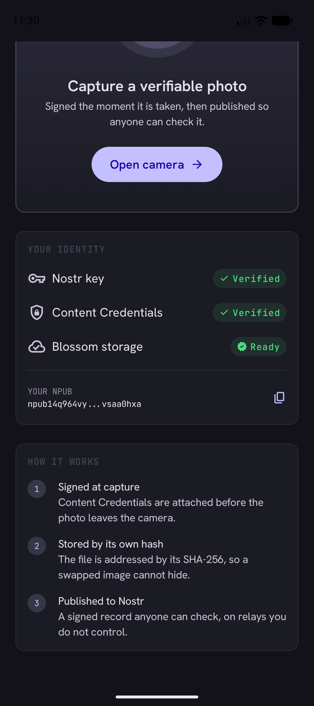
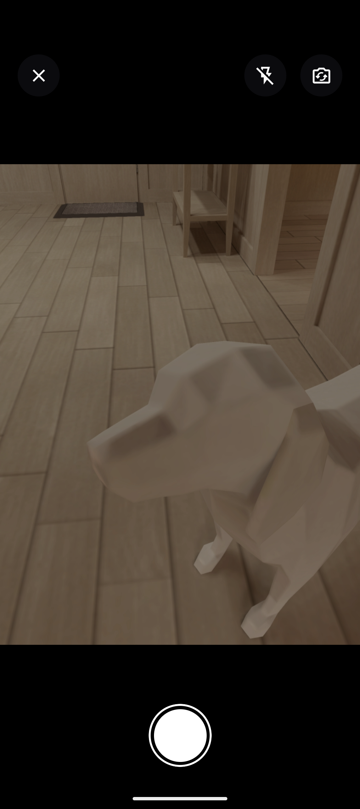
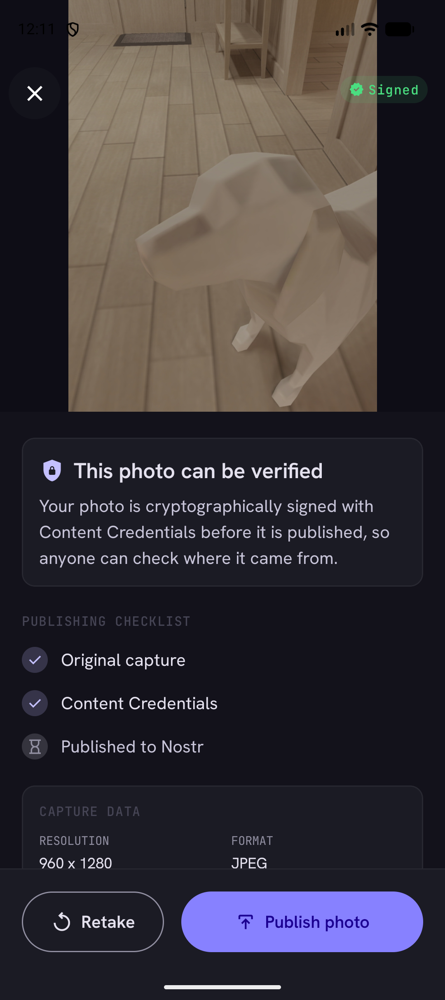
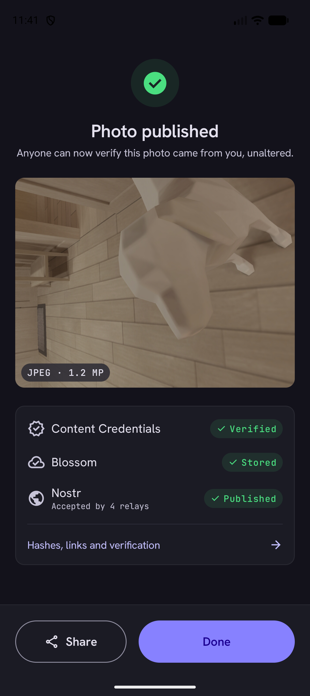
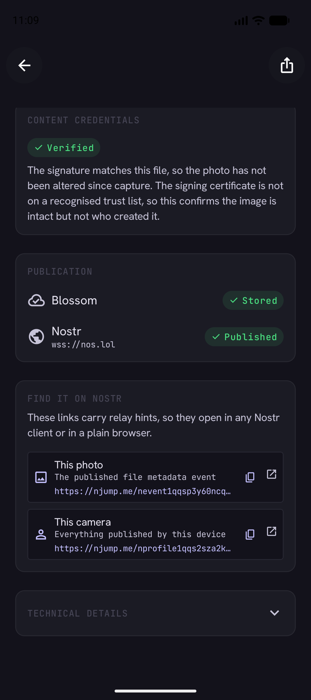

# OpenVeil

**A camera that proves its photographs were not altered — and publishes that proof where
no one can quietly withdraw it.**

OpenVeil signs a photograph at the moment of capture with [C2PA][c2pa] Content
Credentials, stores it on content-addressed [Blossom][blossom] servers, and publishes a
signed [Nostr][nostr] event describing it. Anyone can then check, without trusting
OpenVeil or its author, that the image they are looking at is byte-for-byte the image that
came off the sensor.

> **Status: working proof of concept.** The full capture → sign → store → publish → verify
> pipeline runs end to end on Android against live public infrastructure. It is not yet
> production software; the limitations are listed plainly in
> [Current limitations](#current-limitations).

<p align="center">
  
  
  
  
  
</p>

---

## The problem

Photographic evidence is losing its evidentiary value. Generative models can produce
convincing images of events that never happened, and — more corrosively — their existence
gives anyone caught on camera a ready denial. A journalist or human rights investigator who
publishes a genuine photograph now has to argue for its authenticity, and has no better
tool for that argument than their own credibility.

The usual answer is a trusted platform that vouches for uploads. That fails exactly where
it matters most: a platform can be pressured, can be blocked in the jurisdiction that needs
it, can lose interest, and can quietly delete. Anyone whose safety depends on a photograph
remaining verifiable cannot afford a verifier with a business model.

## The approach

OpenVeil replaces institutional trust with a chain anyone can check independently:

```
   ┌──────────┐   The exact bytes the encoder produced. Never re-encoded.
   │  Sensor  │
   └────┬─────┘
        │
        ▼
   ┌──────────────────┐   The C2PA manifest is hard-bound to those bytes. Any later
   │  Sign (C2PA)     │   edit breaks the binding, and validators report it.
   └────┬─────────────┘
        │
        ▼
   ┌──────────────────┐   SHA-256 of the *signed* bytes. This is the fingerprint
   │  Hash            │   everything downstream refers to.
   └────┬─────────────┘
        │
        ▼
   ┌──────────────────┐   Blossom is content-addressed: the URL *is* the hash, so a
   │  Store (Blossom) │   substituted file cannot go unnoticed.
   └────┬─────────────┘
        │
        ▼
   ┌──────────────────┐   A NIP-94 event carries url + hash + dimensions, signed with
   │  Publish (Nostr) │   the device key, replicated across relays no one party owns.
   └──────────────────┘
```

Each link is verifiable on its own, and the chain closes in both directions: the C2PA
manifest names the Nostr public key that published it, and the Nostr event names the hash
of the file that manifest is bound to. Neither half can be swapped for another without the
mismatch showing.

**What this proves:** that a specific image is byte-identical to what a specific key signed
at capture time, and that it has not been altered since.

**What it does not prove:** that the photographer was where they claim, that any caption is
true, or — in this proof of concept — who the photographer is. Those are different
problems, and conflating them is how provenance tools mislead people. See
[docs/VERIFICATION.md][verification] for precisely what a green tick means and what it does
not.

## Verify it yourself

Every claim above is checkable without running the app, and without trusting this project.
Given a published capture you can fetch the event from a relay, download the blob, re-hash
it, and confirm it matches what was signed.

**[docs/VERIFICATION.md][verification]** walks through the complete procedure, including
validating the C2PA manifest and reading the certificate's trust status honestly.

## What works today

| Capability | Status | Notes |
|---|---|---|
| Camera capture | Working | CameraX; bytes never re-encoded, EXIF orientation preserved |
| C2PA signing | Working | `c2pa.created` + `digitalCapture`, in-memory, ES256 |
| SHA-256 hashing | Working | Over the signed bytes; published as the NIP-94 `x` tag |
| Blossom upload | Working | BUD-01/02 with BUD-11 auth, multi-server fallback |
| Nostr publishing | Working | NIP-94 kind 1063 + NIP-92 `imeta` + companion kind 1 |
| Shareable links | Working | NIP-19 `nevent` / `nprofile` carrying relay hints |
| Re-verification | Working | Re-checks the manifest against the stored bytes, in-app |
| Captions | Working | Published with the photo, deliberately outside the credential |
| Device identity | Working | secp256k1 key generated on device, wrapped by Android Keystore |
| Android | Working | minSdk 28, 16 KB page aligned |
| iOS / Desktop / Web | Not yet | Source sets exist; implementations do not |
| Offline queue | Not yet | Captures survive on disk, but there is no cross-launch retry |
| Trusted certificate | Not yet | Development identity only — see limitations |

## Standards implemented

Implemented directly against the specifications rather than through a framework, because no
maintained Kotlin Multiplatform library covers them. Each is unit-tested against published
vectors or an independent reference implementation.

| Standard | Use |
|---|---|
| [C2PA 2.x][c2pa] | Content Credentials, via the official `c2pa-android` (Rust) SDK |
| [NIP-01][nip01] | Event serialisation, ids, BIP-340 Schnorr signatures |
| [NIP-19][nip19] | `npub`, plus `nevent`/`nprofile` with TLV relay hints |
| [NIP-92][nip92] | `imeta` tag, so ordinary clients render the image inline |
| [NIP-94][nip94] | Kind 1063 file metadata: `url`, `m`, `x`, `ox`, `size`, `dim`, `alt` |
| [BUD-01/02][blossom] | Blossom blob upload and retrieval |
| [BUD-11][bud11] | Kind 24242 authorization events |
| [BIP-340][bip340] | Schnorr signatures, via `secp256k1-kmp` |
| [BIP-173][bip173] | Bech32 encoding |

## Building

**Requirements:** JDK 21 and the Android SDK (API 36). Android Studio is optional — the
Gradle wrapper is sufficient.

```bash
git clone https://github.com/PrarthanaPurohit/OpenVeil.git
cd OpenVeil
```

Generate the development C2PA signing identity. This is deliberately **not** in version
control — a signing key must never be committed, and a certificate without its matching key
would be worse than none, because it looks usable and is not:

```bash
bash tools/generate-dev-cert.sh
```

Then build and test:

```bash
./gradlew :shared:testAndroidHostTest
```

```bash
./gradlew :androidApp:assembleDebug
```

The APK lands in `androidApp/build/outputs/apk/debug/`. Prebuilt APKs are attached to every
[release](../../releases), cut automatically from the default branch.

## Architecture

Three Gradle modules — a split forced by AGP 9, which forbids combining
`com.android.application` with the Kotlin Multiplatform plugin, and useful independently:

```
shared/       Domain and data. No Compose, and no platform SDK types in its public API.
              crypto · nostr · blossom · c2pa · publish · storage
composeApp/   Compose Multiplatform UI. Depends on `shared`; cannot see Ktor or JNI types.
androidApp/   Thin Android host: MainActivity and manifest, no business logic.
```

The UI module's inability to reference networking or native types is enforced by the
dependency graph rather than by convention — `shared` exposes a single assembled
`OpenVeilCore`, which makes "no HTTP types in the UI layer" a fact the compiler checks
rather than a rule people remember.

See **[docs/ARCHITECTURE.md][architecture]** for module boundaries, the publish state
machine, and the ordering guarantees the pipeline depends on.

## Testing

```bash
./gradlew :shared:testAndroidHostTest
```

45 unit tests, concentrated on the places where a silent error would be both invisible and
fatal:

- **NIP-01 event ids**, recomputed from a known published event and cross-checked against
  an independent Python implementation. A single wrong byte in the canonical serialisation
  yields an id every relay rejects, with no useful diagnostic.
- **BIP-340 Schnorr** sign and verify round-trips.
- **Bech32 and NIP-19**, against a real published `npub`, with `nprofile`/`nevent` TLV
  encodings checked against an independent JavaScript reference written from the spec.
- **NIP-94 tags**, including the invariant that `x` comes from the server's response rather
  than a local variable that may have drifted.
- **BUD-11 auth events**: kind, `created_at` in the past, `expiration` in the future, and
  base64url *without* padding — three mistakes that all surface as an opaque HTTP 401.

An opt-in live integration suite exercises real Blossom servers and relays; see
[docs/ARCHITECTURE.md][architecture].

Every push additionally verifies that all native libraries are 16 KB page aligned — a
requirement Google Play enforces for Android 15+ targets, and one a dependency bump can
silently break.

## Current limitations

Stated plainly, because a provenance tool that oversells itself is worse than none.

1. **The signing certificate is a generated development identity.** Validators report
   captures as *Valid* but not *Trusted*: the tamper-evidence is real and independently
   checkable, but nothing vouches for who signed. Production needs a CA-issued certificate
   and a hardware-held key. The app says exactly this rather than showing an unqualified
   tick.
2. **Released APKs are debug-signed** — for sideloading and review, not for Google Play.
3. **No location, ever, in this build.** Publishing to Nostr is irreversible and public, and
   a precise coordinate attached to a photograph is the most harmful thing this pipeline
   could leak. The app does not request the permission, does not read GPS, and writes no
   location assertion.
4. **Identity is per-device and non-portable.** The key is generated on the phone and never
   leaves it. There is no backup, export or import — which also means a lost device is a
   lost identity.
5. **Android only.** The multiplatform structure is real and the domain layer is
   platform-neutral, but only Android has an implementation behind it.
6. **No persistent offline queue.** A signed capture survives on disk if publishing fails
   and can be retried in-session, but not yet across app launches.

## Roadmap

Near-term, in dependency order:

1. **Persistent capture queue** — survive process death and retry publication on reconnect.
   This is the prerequisite for genuinely field-usable offline capture.
2. **Trusted signing identity** — CA enrolment, plus hardware-backed keys via
   `Signer.withCallback` so the private key never enters the process.
3. **iOS** — AVFoundation capture and the `c2pa-swift` bridge. The domain layer is already
   platform-neutral; only the bindings are missing.
4. **Desktop and Web** — verification-focused builds, so a recipient can check a capture
   without installing anything.
5. **Identity portability** — encrypted backup and import, so losing a device is not losing
   an identity.

## Contributing

Issues and pull requests are welcome. CI runs the full test suite, builds the APK, and
checks native library alignment on every pull request.

## License

[MIT](LICENSE).

[c2pa]: https://c2pa.org/specifications/specifications/2.1/index.html
[nostr]: https://github.com/nostr-protocol/nostr
[blossom]: https://github.com/hzrd149/blossom
[bud11]: https://github.com/hzrd149/blossom/blob/master/buds/11.md
[nip01]: https://github.com/nostr-protocol/nips/blob/master/01.md
[nip19]: https://github.com/nostr-protocol/nips/blob/master/19.md
[nip92]: https://github.com/nostr-protocol/nips/blob/master/92.md
[nip94]: https://github.com/nostr-protocol/nips/blob/master/94.md
[bip340]: https://github.com/bitcoin/bips/blob/master/bip-0340.mediawiki
[bip173]: https://github.com/bitcoin/bips/blob/master/bip-0173.mediawiki
[architecture]: docs/ARCHITECTURE.md
[verification]: docs/VERIFICATION.md
