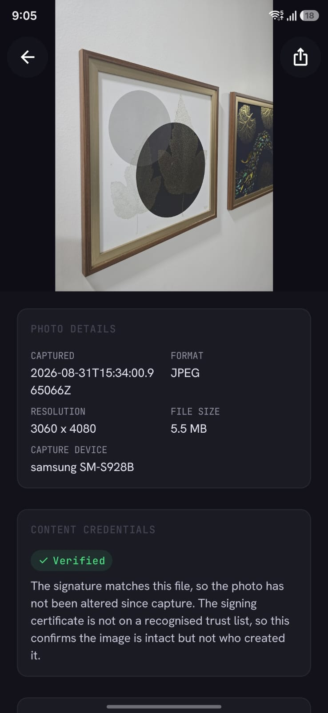
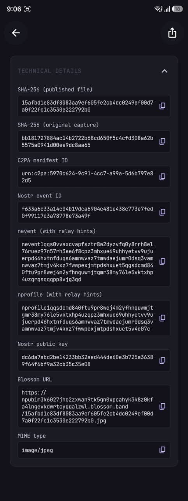
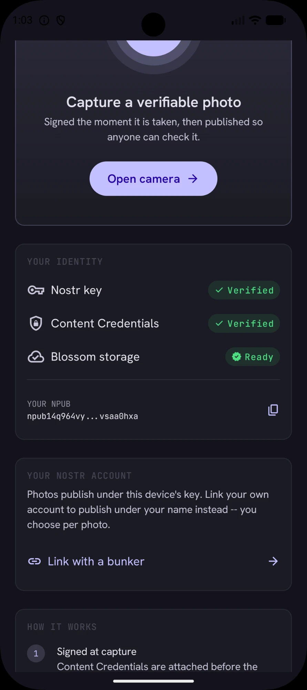
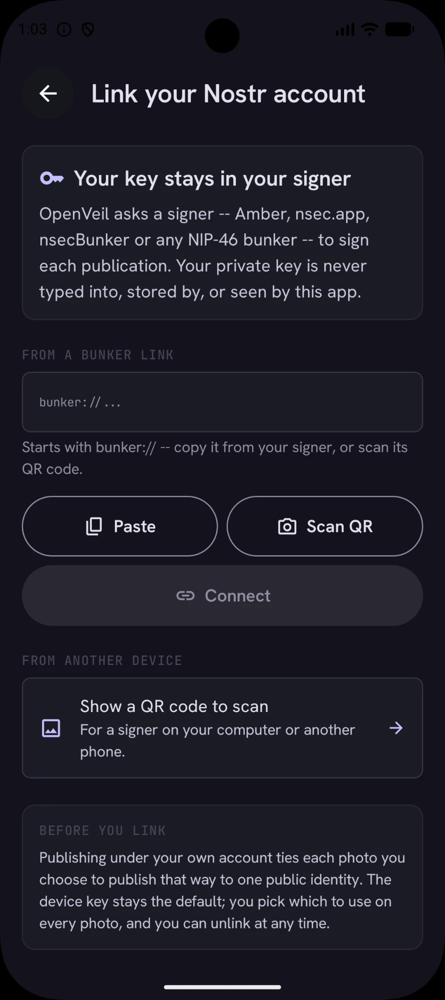
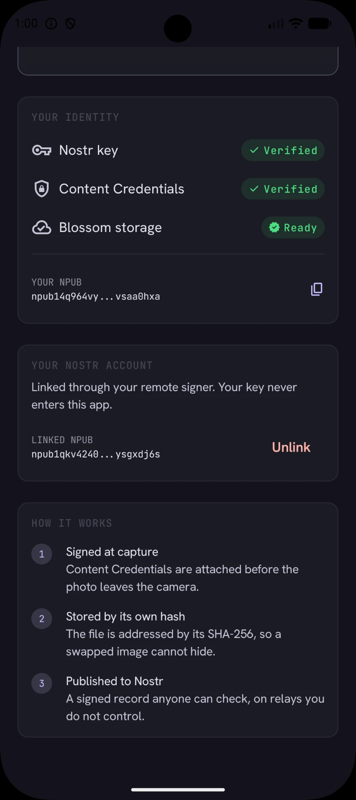
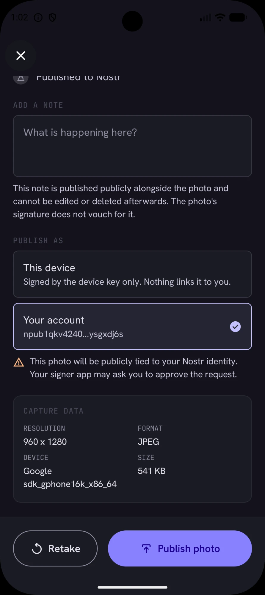

# OpenVeil App

*The Kotlin Multiplatform client. For the Raspberry Pi firmware and the project as a
whole, see the [repository root](../README.md).*

**A camera that proves its photographs were not altered, and publishes that proof where
no one can quietly withdraw it.**

OpenVeil signs a photograph at the moment of capture with [C2PA][c2pa] Content
Credentials, stores it on content-addressed [Blossom][blossom] servers, and publishes a
signed [Nostr][nostr] event describing it. Anyone can then check, without trusting
OpenVeil or its author, that the image they are looking at is byte-for-byte the image that
came off the sensor.

> **Status: working proof of concept.** The full capture → sign → store → publish → verify
> pipeline runs end to end on Android against live public infrastructure. It is not yet
> production software.

<p align="center">
  
  
  
  
  
</p>

<p align="center">
  <em>Home · capture · review · publish · confirmation</em>
</p>

<p align="center">
  
  
  
</p>

<p align="center">
  <em>The full details screen · the credential verdict, stated without overclaiming · every hash and identifier, copyable</em>
</p>

---

## The problem

Photographic evidence is losing its evidentiary value. Generative models can produce
convincing images of events that never happened, and, more corrosively, their existence
gives anyone caught on camera a ready denial. A journalist or human rights investigator who
publishes a genuine photograph now has to argue for its authenticity, and has no better
tool for that argument than their own credibility.

The usual answer is a trusted platform that vouches for uploads. That fails exactly where
it matters most: a platform can be pressured, can be blocked in the jurisdiction that needs
it, can lose interest, and can quietly delete. Anyone whose safety depends on a photograph
remaining verifiable cannot afford a verifier with a business model.

## The approach

OpenVeil replaces institutional trust with a chain anyone can check independently:

```
   ┌──────────┐   The exact bytes the encoder produced. Never re-encoded.
   │  Sensor  │
   └────┬─────┘
        │
        ▼
   ┌──────────────────┐   The C2PA manifest is hard-bound to those bytes. Any later
   │  Sign (C2PA)     │   edit breaks the binding, and validators report it.
   └────┬─────────────┘
        │
        ▼
   ┌──────────────────┐   SHA-256 of the *signed* bytes. This is the fingerprint
   │  Hash            │   everything downstream refers to.
   └────┬─────────────┘
        │
        ▼
   ┌──────────────────┐   Blossom is content-addressed: the URL *is* the hash, so a
   │  Store (Blossom) │   substituted file cannot go unnoticed.
   └────┬─────────────┘
        │
        ▼
   ┌──────────────────┐   A NIP-94 event carries url + hash + dimensions, signed with
   │  Publish (Nostr) │   the device key (or your own account), replicated across
   └──────────────────┘   relays no one party owns.
```

Each link is verifiable on its own, and the chain closes in both directions: the C2PA
manifest names the Nostr public key that published it, and the Nostr event names the hash
of the file that manifest is bound to. Neither half can be swapped for another without the
mismatch showing.

**What this proves:** that a specific image is byte-identical to what a specific key signed
at capture time, and that it has not been altered since.

**What it does not prove:** that the photographer was where they claim, that any caption is
true, or who the photographer is: a linked Nostr account attributes a photo to a key,
not to a person. Those are different problems, and conflating them is how provenance
tools mislead people. See
[docs/VERIFICATION.md][verification] for precisely what a green tick means and what it does
not.

## Verify it yourself

Every claim above is checkable without running the app, and without trusting this project.
Given a published capture you can fetch the event from a relay, download the blob, re-hash
it, and confirm it matches what was signed.

**[docs/VERIFICATION.md][verification]** walks through the complete procedure, including
validating the C2PA manifest and reading the certificate's trust status honestly.

## What works today

| Capability | Status | Notes |
|---|---|---|
| Camera capture | Working | CameraX; bytes never re-encoded, EXIF orientation preserved |
| C2PA signing | Working | `c2pa.created` + `digitalCapture`, in-memory, ES256 |
| SHA-256 hashing | Working | Over the signed bytes; published as the NIP-94 `x` tag |
| Blossom upload | Working | BUD-01/02 with BUD-11 auth, multi-server fallback |
| Nostr publishing | Working | NIP-94 kind 1063 + NIP-92 `imeta` + companion kind 1 |
| Shareable links | Working | NIP-19 `nevent` / `nprofile` carrying relay hints |
| Re-verification | Working | Re-checks the manifest against the stored bytes, in-app |
| Captions | Working | Published with the photo, deliberately outside the credential |
| Device identity | Working | secp256k1 key generated on device, wrapped by Android Keystore |
| Linked account | Working | Optional; via Amber (NIP-55), a `bunker://` link (pasted or scanned), or a `nostrconnect://` QR. Publish under your own npub, chosen per photo |
| Android | Working | minSdk 28, 16 KB page aligned |

## Publishing as yourself

By default a capture is published under the phone's own key, and nothing about it points
at a person. Optionally, you can link your own Nostr account and publish under your name
instead, chosen per photo, never sticky.

<p align="center">
  
  
  
  
</p>

<p align="center">
  <em>Before linking · the link screen · after linking · choosing whose name goes on a photo</em>
</p>

Linking does not change what happens at publish time on its own. Every photo's review
screen defaults to *This device*; tap *Your account* on that photo to publish it under
your npub. This is the screen where the choice is made, and it is the only place.

### Two keys, two jobs

| | Signed by | Why |
|---|---|---|
| Content Credential (C2PA manifest) | **device key, always** | This is the attestation: *this hardware produced these bytes*. A personal key here would prove nothing about the camera. |
| Blossom upload authorization | **device key, always** | Transport-level; nobody reads it as attribution. |
| NIP-94 event + companion note | device key **or** your account | This is the attribution: *who is publishing it*. |

The two are joined by the file's SHA-256, not by trust between the keys: the manifest says
"device X attests to hash H", the event says "person Y publishes hash H", and both are
independently verifiable. The event always carries a `["device", <pubkey>]` tag so a
verifier reading only the event can find the key the manifest names.

### Three ways to link, none of them an nsec

There is deliberately no field to paste a private key. A stored nsec would turn a seized
phone into a loss of the user's entire Nostr identity, not just their photos. Every path
below grants OpenVeil the right to *ask for* signatures, revocably, and nothing more.

| Method | When | How |
|---|---|---|
| **Signer app on this phone** ([NIP-55][nip55], Amber) | Amber is installed | Tap *Use your signer app*; Amber asks which account. The option only appears when a signer app is installed (the screenshots above were taken on an emulator without one). Later signatures are answered silently by Amber's ContentProvider once you tell it to remember, so publishing does not require an app switch. |
| **`bunker://` link** ([NIP-46][nip46]) | Any bunker: nsec.app, nsecBunker, Amber's bunker mode | Paste it from the clipboard, or scan the QR code the bunker shows. |
| **`nostrconnect://` QR** ([NIP-46][nip46]) | The signer is on another device | OpenVeil shows a QR; your signer scans it and calls back. The reply must echo a one-time secret, so a stranger on the relay cannot claim to be your signer. |

Note that scanning a QR is for a bunker on a *different* device: a phone cannot point its
camera at its own screen, so with Amber on the same phone the first option is the right one.

What OpenVeil stores for a linked account: your public key, and either the signer app's
package name or a throwaway conversation key plus the bunker's pubkey and relays. Unlink
removes it. Every event a signer hands back is verified locally (author, id and signature)
before anything is published.

### The trade-off, stated

Publishing under a persistent public identity links every capture you publish that way to
you. For many of the people this app is built for, *not* doing that is the point. So the
device key stays the default, the choice is made on every photo's review screen with the
consequence spelled out next to it, and there is no "always publish as me" setting.

## Standards implemented

Implemented directly against the specifications rather than through a framework, because no
maintained Kotlin Multiplatform library covers them. Each is unit-tested against published
vectors or an independent reference implementation.

| Standard | Use |
|---|---|
| [C2PA 2.x][c2pa] | Content Credentials, via the official `c2pa-android` (Rust) SDK |
| [NIP-01][nip01] | Event serialisation, ids, BIP-340 Schnorr signatures |
| [NIP-19][nip19] | `npub`, plus `nevent`/`nprofile` with TLV relay hints |
| [NIP-44][nip44] | v2 encrypted payloads (ChaCha20 + HMAC-SHA256), the NIP-46 transport |
| [NIP-46][nip46] | Remote signing: `bunker://` links and signer-initiated `nostrconnect://` pairing. The user's key never enters the app |
| [NIP-55][nip55] | Android signer apps (Amber): silent ContentProvider signing, Intent fallback |
| [NIP-92][nip92] | `imeta` tag, so ordinary clients render the image inline |
| [NIP-94][nip94] | Kind 1063 file metadata: `url`, `m`, `x`, `ox`, `size`, `dim`, `alt`, plus a `device` tag naming the attesting key |
| [BUD-01/02][blossom] | Blossom blob upload and retrieval |
| [BUD-11][bud11] | Kind 24242 authorization events |
| [BIP-340][bip340] | Schnorr signatures, via `secp256k1-kmp` |
| [BIP-173][bip173] | Bech32 encoding |

## Building

**Requirements:** JDK 21 and the Android SDK (API 36). Android Studio is optional; the
Gradle wrapper is sufficient.

```bash
git clone https://github.com/PrarthanaPurohit/OpenVeilCam.git
cd OpenVeilCam/app
```

Generate the development C2PA signing identity. This is deliberately **not** in version
control: a signing key must never be committed, and a certificate without its matching key
would be worse than none, because it looks usable and is not:

```bash
bash tools/generate-dev-cert.sh
```

Then build and test:

```bash
./gradlew :shared:testAndroidHostTest
```

```bash
./gradlew :androidApp:assembleDebug
```

The APK lands in `androidApp/build/outputs/apk/debug/`. Prebuilt APKs are attached to every [release](../../../releases) tagged `app-v*`, cut
automatically when a change under `app/` reaches the default branch. There is one APK
per architecture; most phones need `arm64-v8a`.

## Architecture

Three Gradle modules, a split forced by AGP 9, which forbids combining
`com.android.application` with the Kotlin Multiplatform plugin, and useful independently:

```
shared/       Domain and data. No Compose, and no platform SDK types in its public API.
              crypto · nostr (nip44, nip46, nip55) · blossom · c2pa · publish · storage
composeApp/   Compose Multiplatform UI. Depends on `shared`; cannot see Ktor or JNI types.
androidApp/   Thin Android host: MainActivity and manifest, no business logic.
```

The UI module's inability to reference networking or native types is enforced by the
dependency graph rather than by convention: `shared` exposes a single assembled
`OpenVeilCore`, which makes "no HTTP types in the UI layer" a fact the compiler checks
rather than a rule people remember.

See **[docs/ARCHITECTURE.md][architecture]** for module boundaries, the publish state
machine, and the ordering guarantees the pipeline depends on.

## Testing

```bash
./gradlew :shared:testAndroidHostTest
```

Well over a hundred unit tests, concentrated on the places where a silent error would be both invisible and
fatal:

- **NIP-01 event ids**, recomputed from a known published event and cross-checked against
  an independent Python implementation. A single wrong byte in the canonical serialisation
  yields an id every relay rejects, with no useful diagnostic.
- **BIP-340 Schnorr** sign and verify round-trips.
- **Bech32 and NIP-19**, against a real published `npub`, with `nprofile`/`nevent` TLV
  encodings checked against an independent JavaScript reference written from the spec.
- **NIP-94 tags**, including the invariant that `x` comes from the server's response rather
  than a local variable that may have drifted.
- **NIP-44 v2**, against the official test vectors: conversation keys, message keys, padding,
  encrypt/decrypt, and every rejected-input case.
- **NIP-46 end to end**, against an in-process relay that is also the bunker: pairing with a
  secret, `get_public_key`, `sign_event` with local verification of the reply, the `auth_url`
  detour, refusal of a tampered signature, and signer-initiated `nostrconnect://` pairing --
  including that a reply without our secret is ignored.
- **NIP-55 linking**, against a fake signer app: only publishing permissions are requested,
  the link survives a restart, signed events verify under the user's key, a refusal leaves
  nothing linked, and no key material is ever stored for a signer-app session.
- **Bech32 decode**, which surfaced a latent 26-bit `polymod` mask in the encoder (BIP-173
  says 25). Encoding happened to survive it; verification did not.
- **BUD-11 auth events**: kind, `created_at` in the past, `expiration` in the future, and
  base64url *without* padding: three mistakes that all surface as an opaque HTTP 401.

An opt-in live integration suite exercises real Blossom servers and relays; see
[docs/ARCHITECTURE.md][architecture].

Every push additionally verifies that all native libraries are 16 KB page aligned, a
requirement Google Play enforces for Android 15+ targets, and one a dependency bump can
silently break.

## Roadmap

Near-term, in dependency order:

1. **Persistent capture queue**: survive process death and retry publication on reconnect.
   This is the prerequisite for genuinely field-usable offline capture.
2. **Trusted signing identity**: CA enrolment, plus hardware-backed keys via
   `Signer.withCallback` so the private key never enters the process.
3. **iOS**: AVFoundation capture and the `c2pa-swift` bridge. The domain layer is already
   platform-neutral; only the bindings are missing.
4. **Desktop and Web**: verification-focused builds, so a recipient can check a capture
   without installing anything.
5. **Identity portability**: encrypted backup and import, so losing a device is not losing
   an identity.

## Contributing

Issues and pull requests are welcome. CI runs the full test suite, builds the APK, and
checks native library alignment on every pull request.

## License

[MIT](../LICENSE), covering the whole repository.

[c2pa]: https://c2pa.org/specifications/specifications/2.1/index.html
[nostr]: https://github.com/nostr-protocol/nostr
[blossom]: https://github.com/hzrd149/blossom
[bud11]: https://github.com/hzrd149/blossom/blob/master/buds/11.md
[nip01]: https://github.com/nostr-protocol/nips/blob/master/01.md
[nip19]: https://github.com/nostr-protocol/nips/blob/master/19.md
[nip44]: https://github.com/nostr-protocol/nips/blob/master/44.md
[nip46]: https://github.com/nostr-protocol/nips/blob/master/46.md
[nip55]: https://github.com/nostr-protocol/nips/blob/master/55.md
[nip92]: https://github.com/nostr-protocol/nips/blob/master/92.md
[nip94]: https://github.com/nostr-protocol/nips/blob/master/94.md
[bip340]: https://github.com/bitcoin/bips/blob/master/bip-0340.mediawiki
[bip173]: https://github.com/bitcoin/bips/blob/master/bip-0173.mediawiki
[architecture]: docs/ARCHITECTURE.md
[verification]: docs/VERIFICATION.md
